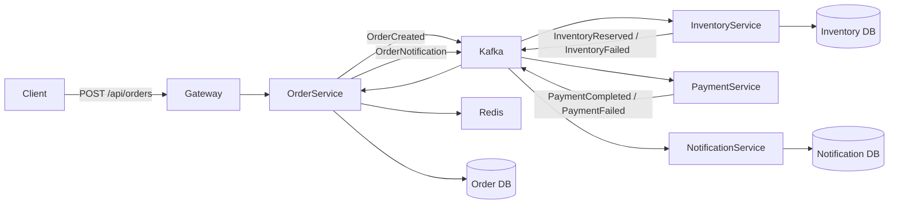

# Order Processing Platform

A production-shaped, fully runnable microservices demo built for a backend/cloud profile:

- **API Gateway** with API key auth and simple rate limiting
- **Order Service** with PostgreSQL persistence and Redis-backed order read caching
- **Inventory Service** with PostgreSQL persistence and Kafka-driven reservations
- **Payment Service** with deterministic payment simulation
- **Notification Service** with persisted notification logs
- **Kafka** event flow with a simple compensation step on payment failure

## Tech stack

- Java 17
- Spring Boot 4.0.5
- Spring Cloud 2025.1.1
- Spring Cloud Gateway Server Web MVC
- Spring for Apache Kafka
- PostgreSQL
- Redis
- Docker Compose

## Architecture



## Happy path flow

1. Client calls `POST /api/orders` through the gateway.
2. Order service stores the order as `CREATED` and publishes `OrderCreated`.
3. Inventory service reserves stock and publishes `InventoryReserved`.
4. Payment service simulates payment and publishes `PaymentCompleted`.
5. Order service marks the order `COMPLETED` and publishes a notification event.
6. Notification service stores the notification log.

## Failure flow

If payment fails:
1. Order service marks the order `FAILED`.
2. Order service publishes `ReleaseInventory`.
3. Inventory service adds the reserved quantity back.
4. Order service publishes a failure notification.

## Run with Docker Compose

### 1. Start everything

```bash
docker compose up --build
```

That builds all five Spring Boot services and starts Kafka, Redis, and PostgreSQL.

### 2. Create a successful order

Use an amount **<= 1000** to simulate payment success:

```bash
curl --location 'http://localhost:8080/api/orders' \
--header 'Content-Type: application/json' \
--header 'X-API-KEY: dev-api-key' \
--data '{
  "productCode": "MACBOOK_PRO_14",
  "quantity": 1,
  "amount": 999.99,
  "customerEmail": "vishal@example.com"
}'
```

### 3. Check the order status

Replace `<ORDER_ID>` with the value returned from step 2:

```bash
curl --location 'http://localhost:8080/api/orders/<ORDER_ID>' \
--header 'X-API-KEY: dev-api-key'
```

Expected final status: `COMPLETED`

### 4. Check inventory

```bash
curl --location 'http://localhost:8080/api/inventory/MACBOOK_PRO_14' \
--header 'X-API-KEY: dev-api-key'
```

### 5. Check notification log

```bash
curl --location 'http://localhost:8080/api/notifications/order/<ORDER_ID>' \
--header 'X-API-KEY: dev-api-key'
```

## Try the failure path

Use an amount **> 1000**:

```bash
curl --location 'http://localhost:8080/api/orders' \
--header 'Content-Type: application/json' \
--header 'X-API-KEY: dev-api-key' \
--data '{
  "productCode": "AIRPODS_PRO_2",
  "quantity": 1,
  "amount": 1500.00,
  "customerEmail": "vishal@example.com"
}'
```

Expected final status: `FAILED`

Inventory will be released automatically by the compensation event.

## Seeded inventory

The inventory service auto-seeds these products:

- `MACBOOK_PRO_14` → 10
- `AIRPODS_PRO_2` → 25
- `IPHONE_16` → 15
- `KINDLE_PAPERWHITE` → 20

## Endpoints

### Gateway
- `POST /api/orders`
- `GET /api/orders/{orderId}`
- `GET /api/inventory/{productCode}`
- `GET /api/notifications`
- `GET /api/notifications/order/{orderId}`

### Internal services
- `GET /orders/{orderId}`
- `GET /inventory/{productCode}`
- `GET /notifications`
- `GET /notifications/order/{orderId}`

## Security and platform notes

This project intentionally keeps auth simple with a gateway API key so the whole stack is easy to run locally. In a production version, you would typically replace this with:

- OAuth2 / JWT
- proper centralized rate limiting
- service discovery / service mesh
- schema registry or stronger event contracts
- outbox pattern for guaranteed delivery
- OpenTelemetry and dashboards
- contract tests and load tests

## Local host-based run without Docker builds

If you prefer running services from your IDE:
1. Start Kafka, Redis, and Postgres only from `docker-compose.yml`.
2. Run each Spring Boot service from IntelliJ.
3. Default `application.yml` files already point to localhost-based ports.

## Suggested next upgrades

- replace API key auth with JWT
- add OpenTelemetry tracing
- use the outbox pattern
- add GitHub Actions CI/CD
- deploy the same stack to EKS
